# Song Recommender

The Recommendation system can show similar songs to a song. It can also recommend songs acoording to user liked songs.  

## Table of Contents

- [Technologies Used](#technologies-used)
- [Feature Engineering](#feature-engineering)
- [Similarity Calculation](#similarity-calculation)
- [Installation](#installation)
- [Usage](#usage)
- [Screenshots for Reference](#screenshots-for-reference)

## Technologies Used

- **Frontend:** React.js ([React.js](https://reactjs.org/))
- **Backend:** Django([[Django](https://www.djangoproject.com/start/overview/)]) and Django REST framework([DRF](https://www.django-rest-framework.org/))
- **Database:** SQLite([sqlite](https://www.sqlite.org/))
- **Contanerisation:** Docker ([Docker](https://docs.docker.com/engine/reference/builder/))
- **Data Processing and ML:** Pandas[Pandas(https://pandas.pydata.org/)], Numpy([Numpy](https://numpy.org/)), Scikit-learn([sklearn](https://scikit-learn.org/stable/))
- **Dataset:** Kaggle ([spotify-600k-tracks](https://www.kaggle.com/datasets/yamaerenay/spotify-dataset-19212020-600k-tracks))

# Feature Engineering
The idea is to represents songs into linear vectors according to there audio features such as danceability,
energy, loudness, speechiness, acousticness etc. and other categorical features such as genres, release year, key (major note of track [0: C, 1: C#/Db, 2: D, …]), etc.

## For the Genres 

### 1.Word Embeddings (Word2Vec)

We use Word2Vec to create meaningful numerical representations (vectors) for genres. This helps us understand the relationships between different types of music.

### 2.TF-IDF Weighting

We apply TF-IDF (Term Frequency-Inverse Document Frequency) to the genre vectors. This step makes rare and important genres more influential in our track representations.

### 3. Weighted Average

By calculating a weighted average of genre vectors for each track (tf-idf is used as weights), we create a unique representation for every song based on its genres.

## For Categorical and Numerical Variable

### Categorical Variable Encoding

#### Era Flags

Era flags are created by dividing songs into decades (e.g., 40s, 50s) to capture historical trends and associations with different time periods.

#### One-Hot Encoding

We use one-hot encoding for categorical variables like "key," "time_signature," and "era_flags". This encoding transforms these categorical variables into binary vectors, with each category represented as a binary column.


### Numerical Variable Encoding

#### Bucketing

For numerical variables such as artists' followers, track popularity, and artist popularity, we employ bucketing. This technique groups numerical values into ranges (0-5, 6-10) and converts them into categorical features. This helps manage dimensionality and making them suitable for categorical analysis.

#### PCA Dimensionality Reduction: 
Used to simplify numerical variables, making them easier to work with for cosine similarity calculations. This step helps improve the efficiency and scalability of the recommendation system.


# Similarity Calculation 

## Cosine Similarity 

Cosine similarity is a mathematical concept used in various fields, including natural language processing and recommendation systems, to determine the similarity between two vectors. In the context of song recommendation systems, cosine similarity can be a powerful approach.

### How Does It Work?

1. **Vector Representation**: Each song is represented as a vector in a multi-dimensional space, with each dimension corresponding to a feature such as genre, tempo, mood, or instrument usage.

2. **Cosine Calculation**: When a user interacts with a song (e.g., listens to it, adds it to a playlist), their preferences are captured as a vector. To recommend similar songs, the cosine similarity between the user's vector and other song vectors is calculated.

3. **Similarity Measurement**: Cosine similarity measures the cosine of the angle between two vectors. A higher cosine value indicates a smaller angle and thus greater similarity between the songs.


Cosine similarity, with its simplicity and effectiveness, plays a vital role in enhancing user experience and engagement in music streaming platforms.

## Similar Songs

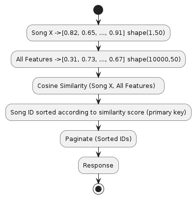 </br>

## Like/Unlike Songs

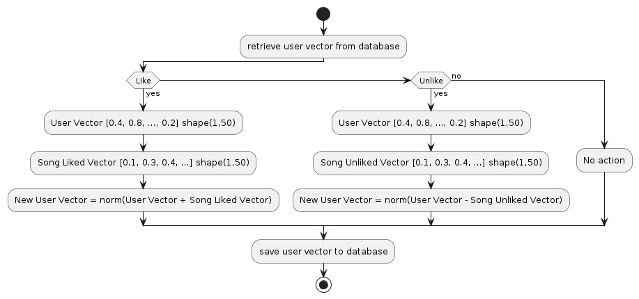 </br>


## Installation

**Prerequisites:**

- Docker installed and Running: [https://www.docker.com/products/docker-desktop/](https://www.docker.com/products/docker-desktop/)

**Instructions:**

1. Clone this repository:

   ```bash
   git clone https://github.com/SumitRathor002/songsrecommendation.git
   ```

2. Navigate to the project directory:

   ```bash
   cd songsrecommendation
   ```

3. Start the application:

   ```bash
   docker-compose up
   ```
   It takes around 600 seconds to populate database, please be patient

4. Access the application:

   The application is likely accessible in your web browser at `http://localhost:<3000>`

## Usage

- The application presents you random songs on home page if you are guest user, 
- It redirdects you to a signup page if you try to use features such History, Favourites, Like 
- You can also here preview audio if its available 
- If you are Logged In user 
  - Personalized Recommendation on Home feed 
  - you can Like/Unlike Songs
  - you can see your Liked songs in /Favourites
  - you can see your history in /History

## Screenshots for Reference

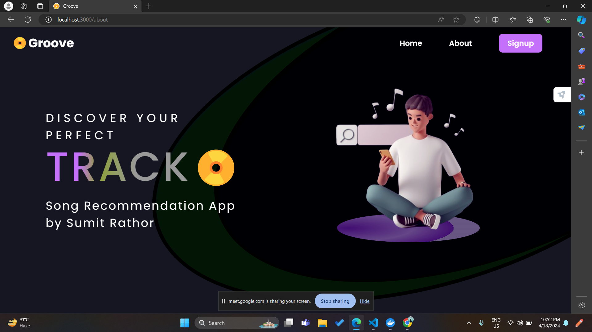 </br>

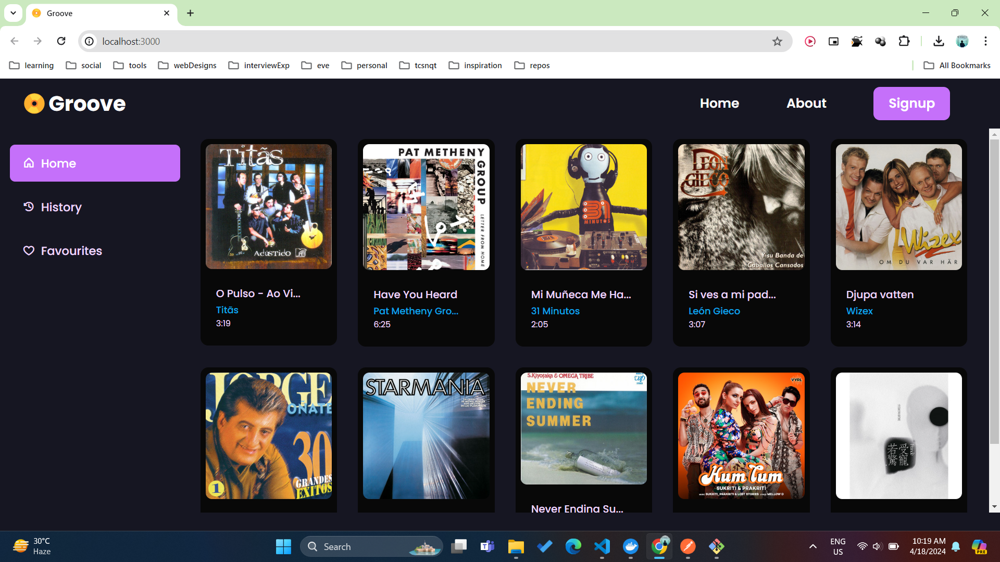 </br>

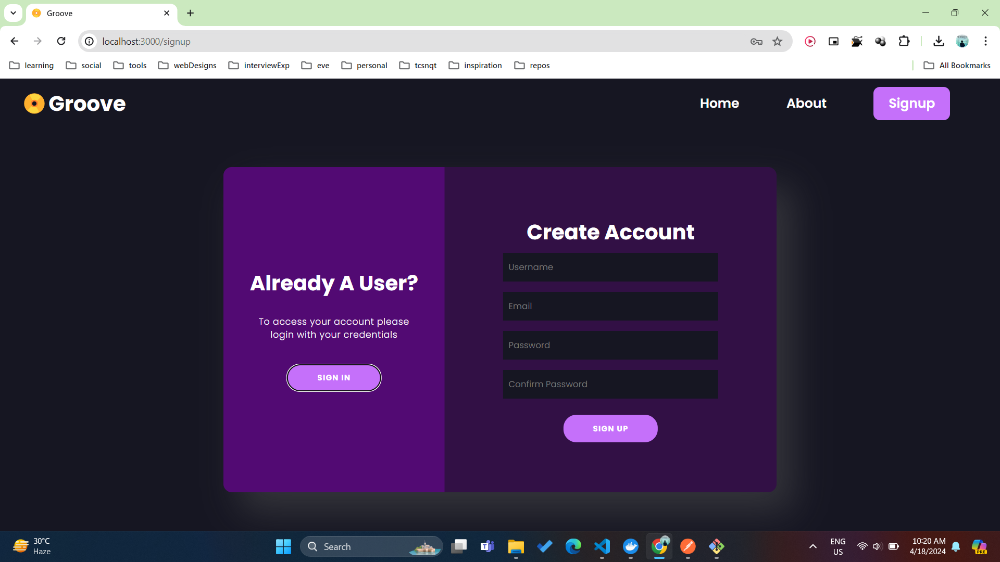 </br>

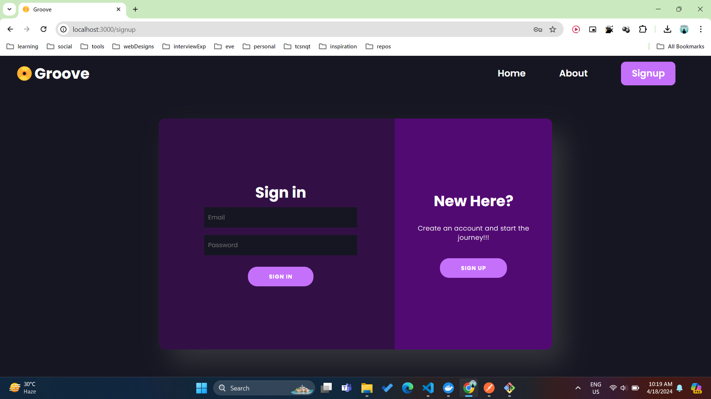 </br>

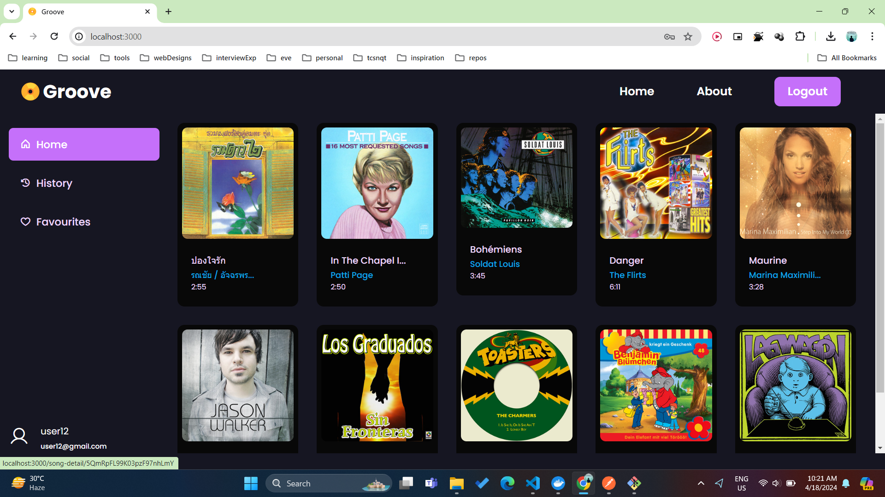 </br>

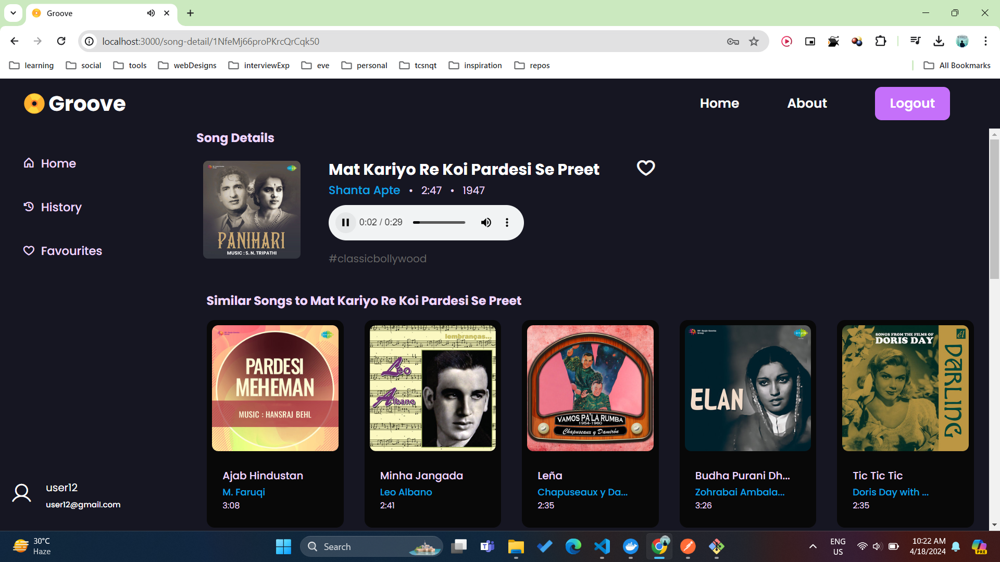 </br>

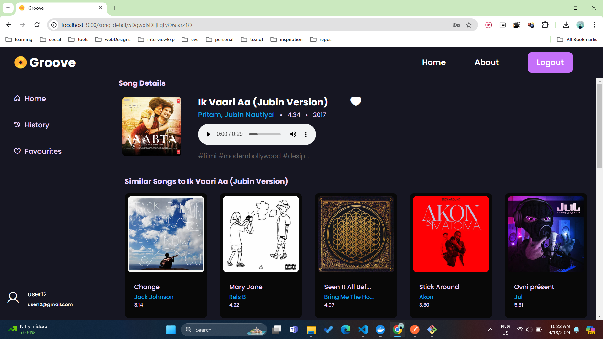 </br>

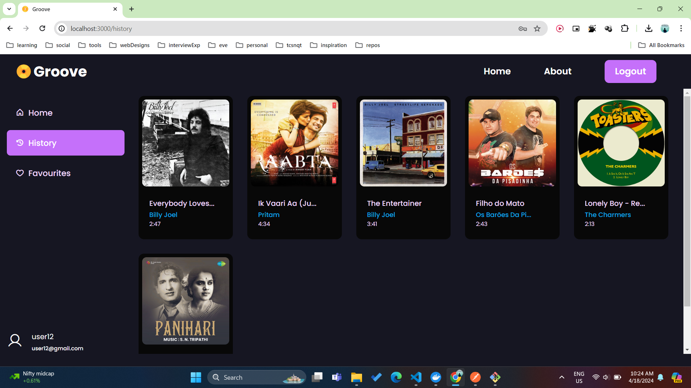 </br>

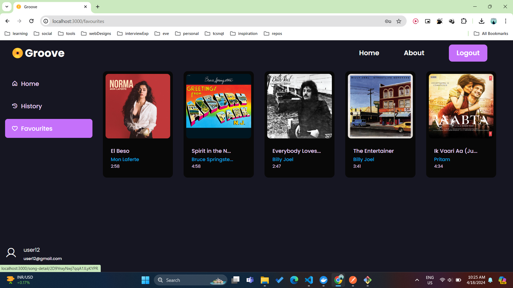 </br>